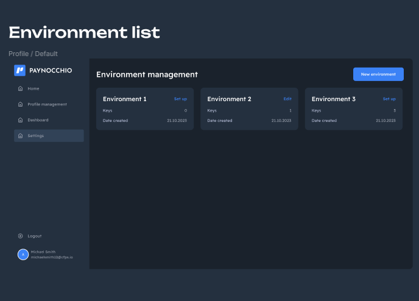

[![Contributors][contributors-shield]][contributors-url]
[![Forks][forks-shield]][forks-url]
[![Stargazers][stars-shield]][stars-url]
[![Issues][issues-shield]][issues-url]
[![MIT License][license-shield]][license-url]
[![LinkedIn][linkedin-shield]][linkedin-url]

<p align="center">

<h1 align="center">Paynocchio</h1>
</p>

**[Quickstart](#Quickstart)** |
**[Documentation](https://github.com/PAYNOCCHIO/paynocchio-api-alpha/tree/doc/readme-feature/API)** |
**[Site](https://paynocchio.com/)** |
**[License](#License)** |
**[Team](#Team)** |
**[Getting help](#FAQ)** |

## Overview
PAYNOCCHIO is more than a typical payment processing service. We provide a comprehensive solution, operating as a ledger infrastructure. Our integrated services include roles as an issuing processor and program manager, along with offering closed-loop wallets. This enhances our extensive capabilities in payment processing.

## Table of contents
```
API/
├── api.md                       # api usage
resourses/                       # images
README.md                        # overview
LICENSE                          # public MIT license
CHANGELOG.md                     # changelog
```

## Features
* **Feature 1** — Create wallet
* **Feature 2** — Withdraw
* **Feature 3** — TopUp
* **Feature 4** — Payment

## Quickstart

<h1 align="center">Without Environments</h1>
<p align="center">

</p>

<h1 align="center">Create environment</h1>
<p align="center">

</p>

<h1 align="center">Environment list</h1>
<p align="center">

</p>

<h1 align="center">Without key</h1>
<p align="center">

</p>

<h1 align="center">Create new key</h1>
<p align="center">

</p>

<h1 align="center">Environment with key</h1>
<p align="center">

</p>

<h1 align="center">Environment actions list</h1>
<p align="center">

</p>

<h1 align="center">Decrypted api key</h1>
<p align="center">

</p>

## Team

- __Abay Serkebayev__        | CEO / Founder
- __Mikhail Moiseev__        | System Analyst
- __Anastasia Maximova__     | Business Analyst
- __Alexander Mochinov__     | BackEnd Engineer
- __Semyon Berezovsky__      | BackEnd Engineer
- __Ivan Tsenilov__          | FrontEnd Engineer
- __Sergey Anishchenko__     | FrontEnd Engineer
- __Ilya Poplavsky__         | QA Engineer
- __Anton Abramenko__        | DevOps Engineer

## FAQ

<<<<<<< Updated upstream
- Q1
    - Answer 1
- Q2
    - Answer 2
=======
- Where can I find information about the project
    - [Answer 1](https://paynocchio.com/)
- Where can I find the api documentation
    - [Answer 2](https://github.com/PAYNOCCHIO/paynocchio-api-alpha/blob/doc/readme-feature/API/wallet.md)
- How using test mode(Development environment)
    - We try hard every day for update our platform. Test mode(Development environment) will be realised soon.
>>>>>>> Stashed changes

## Changelog
See [CHANGELOG.md](https://github.com/PAYNOCCHIO/paynocchio-api-alpha/blob/main/CHANGELOG.md) for details.

## License
MIT [License](https://github.com/PAYNOCCHIO/paynocchio-api-alpha/blob/main/LICENSE)

## Stay in touch
[Our site](https://paynocchio.com/team)

### Dev Meeting

We have videoconference meetings `<every week>` where we discuss what we have been working on and get feedback from one another.

<<<<<<< Updated upstream
[our mettings]()
=======
[Our mettings]()


<!-- MARKDOWN LINKS & IMAGES -->
<!-- https://www.markdownguide.org/basic-syntax/#reference-style-links -->
[contributors-shield]: https://img.shields.io/github/contributors/PAYNOCCHIO/paynocchio-api-alpha.svg?style=for-the-badge
[contributors-url]: https://github.com/PAYNOCCHIO/paynocchio-api-alpha/graphs/contributors
[forks-shield]: https://img.shields.io/github/forks/PAYNOCCHIO/paynocchio-api-alpha.svg?style=for-the-badge
[forks-url]: https://github.com/PAYNOCCHIO/paynocchio-api-alpha/network/members
[stars-shield]: https://img.shields.io/github/stars/PAYNOCCHIO/paynocchio-api-alpha.svg?style=for-the-badge
[stars-url]: https://github.com/PAYNOCCHIO/paynocchio-api-alpha/stargazers
[issues-shield]: https://img.shields.io/github/issues/PAYNOCCHIO/paynocchio-api-alpha.svg?style=for-the-badge
[issues-url]: https://github.com/PAYNOCCHIO/paynocchio-api-alpha/issues
[license-shield]: https://img.shields.io/github/license/PAYNOCCHIO/paynocchio-api-alpha.svg?style=for-the-badge
[license-url]: https://github.com/PAYNOCCHIO/paynocchio-api-alpha/blob/master/LICENSE.txt
[linkedin-shield]: https://img.shields.io/badge/-LinkedIn-black.svg?style=for-the-badge&logo=linkedin&colorB=555
[linkedin-url]: https://linkedin.com/in/paynocchio
>>>>>>> Stashed changes
